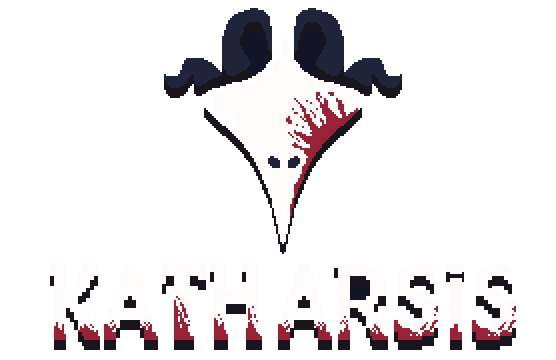

# Katharsis
Katharsis is a 2D action-platformer with a dark atmosphere, created using the Pygame engine. Embark on a journey through a mysterious forest, battle ghostly creatures whose souls are afflicted by an unknown disease, and uncover the secrets of this world.

<div align="center">
  
</div>

## About the Game
You play as a nameless hero, sent from "on high" into a grim forest. Your mission is to defeat creatures whose souls have been twisted by a mysterious malady. The gameplay is inspired by classic platformers and offers dynamic combat, level exploration, and boss battles.

A unique feature of the game is its "Mega Man"-style camera, which transitions between screens, creating the feel of distinct rooms and battle arenas.

## Building
### Requirements
- Python 3.x
- Pygame Community Edition (pygame-ce)

### Installation and Build
1. Clone the repository:
```bash
git clone https://your-repository-url/katharsis.git
cd katharsis
```
2. Install dependencies:
It is recommended to create a virtual environment.
```bash
# Create a virtual environment (optional)
python -m venv venv
source venv/bin/activate  # For Windows: venv\Scripts\activate

# Install Pygame and Nuitka
pip install pygame-ce nuitka
```
3. Run building with Nuitka:
```bash
python -m nuitka --standalone --windows-disable-console --output-dir=build --include-data-dir=./Fonts=Fonts --include-data-dir=./Music=Music --include-data-dir=./Rooms=Rooms --include-data-dir=./Sounds=Sounds --include-data-dir=./Sprites=Sprites main.py
```

## Contribution
- **Programmer:** [Volterith](https://t.me/volterith_shelter)
- **Spriter:** [ItsFrancesco78](https://t.me/charchive078)
- **Musicians:**
  - [RinnyTheFlurry](https://t.me/rin_live12)
  - [Danill Vlasenko](https://t.me/longroadhomeDV)
